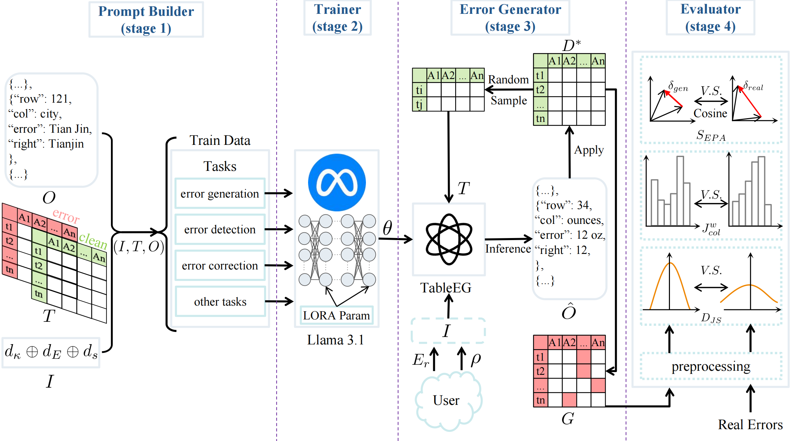

<h1 align="center">🚀 Towards Practical Benchmarking of Data Cleaning Techniques: On Generating Authentic Errors via Large Language Models</h1>
<h3 align="center">A framework for generating realistic tabular data errors using LLMs</h3>

#📌 Overview

### 📖 Abstract

Data quality remains an important challenge in data-driven systems, as errors in tabular data can severely compromise downstream analytics and machine learning performance. Although numerous error detection algorithms have been proposed, the lack of diverse, real-world error datasets limits comprehensive evaluation. Manual error annotation is both time-consuming and inconsistent, motivating the exploration of synthetic error generation as an alternative. 

In this work, we introduce **TableEG**, a framework that leverages large language models (LLMs) to generate authentic errors. By employing a table fine-tuning strategy and a triplet representation $(I, T, O)$ to model error generation, detection, and correction tasks, TableEG captures the complex dependencies inherent in two-dimensional tables. 

Trained on **12 real-world datasets** spanning **10 diverse domains**, TableEG ensures that the synthesized errors faithfully reflect authentic error distributions. Experimental results indicate that errors generated by TableEG exhibit **superior pattern and distribution similarity** compared to both rule-based methods and LLM-generated errors without fine-tuning. 


📊 **Key Findings**:

✅ TableEG-generated errors **closely align with real-world errors** in both distribution and pattern.

✅ Machine learning-based error detection methods **perform consistently across TableEG errors and real-world errors**.

✅ TableEG **bridges the gap between synthetic and real-world errors**, providing a **robust benchmark** for future data cleaning research.


### 🏗 Framework Overview




# 🔥 Usage

### ⚙️ Environment Setup
```bash
git clone git@github.com:viviancircle/TableEG.git
cd TableEG
# We use Python3.8, PyTorch2.4.1.
conda env create -f TableEG_env.yaml
conda activate TableEG_env
cd TableEG
```


### 📂 Dataset and Model Resources for TableEG

This repository contains **all datasets and model parameters** used in our experiments. Additionally, all related files have been uploaded to **Google Drive**:
📂 [**All the dataset and model files**](https://drive.google.com/drive/folders/10LdB9LGgymbI6W8D2936uRF6eFRL24xy?usp=sharing)

Below is a **structured breakdown** of dataset and model files, including storage locations and usage details.

**🏛 Directory Structure and Data Description**

**1️⃣ Source Data (source/)**

- This folder contains **12 real-world datasets**, each with:

  - `clean.csv`: The original, error-free version of the dataset.

  - `dirty.csv`: The corrupted version of the dataset with injected errors.

  - `*_annotation.jsonl`: The labeled error information for each dataset.

- The datasets are stored directly in the **root directory** under `source/`.

**2️⃣ Processed Dataset for Fine-tuning (dataset/)**

- This directory contains datasets processed by our **prompt_builder**, structured for training and evaluation.

- The processed datasets are converted into **instruction-input-output triplets**, suitable for **LLM fine-tuning**.

- The dataset includes:

  - `train/`: Training data for fine-tuning.

  - `test/`: Testing data for evaluation.

  - These datasets are stored in the **root directory** under ` dataset/`.

**3️⃣ Fine-tuned Model Parameters (llama3.1_lora_config/)**

- This folder contains the **LoRA fine-tuning parameters** obtained after training our model on the processed dataset.

- Usage:

  - Download **[LLaMA 3.1](https://huggingface.co/meta-llama/Llama-3.1-8B)** base model separately.

  - Load the parameters stored in this folder to **restore the fine-tuned model**.

  - The model parameters are stored in the **root directory** under `llama3.1_lora_config/`.

**4️⃣ Evaluation Dataset (evaluation/test_dataset/)**

- This directory contains datasets used for model evaluation.

- Includes:

  - `exp_1/`: Contains test datasets used in different evaluation settings.

  - `BART_output/`: Outputs from BART for comparison.

  - `GPT_output/`: Outputs from GPT-based methods.

  - `model_output/`: Outputs from our **TableEG model**.

- This directory is located under `evaluation/`.

**5️⃣ Error Pattern Alignment Embeddings (evaluation/real_errors_unique.json)**

- This file stores **precomputed embeddings** for real-world errors, used in **Error Pattern Alignment Evaluation**.

- If this file exists, you can **skip generating embeddings again**.

- Stored in` evaluation/`.


### 📊 Data Source

The datasets used in this work contain both **clean** and **real-world erroneous** data, primarily sourced from [**CleanML**](https://github.com/chu-data-lab/CleanML) **and** [**Raha**](https://github.com/BigDaMa/raha). These datasets span multiple domains and include various error types to ensure diverse and realistic data corruption patterns.

| Dataset            | Rows  | Columns | Domain         | Error Rate | Error Types (M/P/R/O) |
|--------------------|--------|----------|---------------|------------|----------------------|
| Rayyan            | 1,000  | 11       | Academic      | 8.62%      | M, P, R |
| Company           | 128,889| 7        | Business      | 34.21%     | P, R |
| Marketing         | 8,993  | 14       | Business      | 21.29%     | M, P |
| Movie (Metadata)  | 7,390  | 17       | Entertainment | 6.10%      | M, P |
| Movie (Box Office)| 9,329  | 7        | Entertainment | 7.31%      | P |
| Credit            | 150,000| 10       | Finance       | 2.33%      | M, O |
| Beers             | 2,410  | 11       | Food          | 12.66%     | M, P, R |
| Restaurant        | 12,007 | 10       | Food          | 0.53%      | P |
| Hospital         | 1,000  | 20       | Health        | 2.55%      | P, R |
| Airbnb            | 42,492 | 40       | Hospitality   | 0.22%      | M, O |
| University        | 286    | 17       | Education     | 13.97%     | P |
| Sensor           | 62,076 | 8        | Technology    | 0.01%      | O |
| Flights          | 2,376  | 7        | Transportation| 24.15%     | M, P, R |


# 🛠 Run the Framework

### 🚀 Generate Training Data (Prompt_Builder)

```bash
bash generate_data.sh
```


### 🏋️ Train the Model (Trainer)

```bash
python train/train_llama3_lora.py
```


### 🔄 Generate Errors (Error_Generator)

```bash
python error_generator/generate_error.py
```

**📌 Configuration:**

- **Error Ratio (error_ratio)**: Defines the proportion of erroneous cells to be introduced into the dataset. (*e.g., 0.2 for 20% errors*)

- **Error Type Ratios (error_type_ratios)**: Specifies the distribution of error types in the format "outliers:missing_value:pattern_violation:rule_violation". (*e.g., "1:2:4:3*")

**📌 Example Usage:**

Modify the script `generate_error.py` to adjust error parameters as needed:

```python
error_log_path, used_cells = error_generator.generate_errors_across_dataset(
    df_clean,
    latent_vio_path,
    error_ratio=0.2,  # 20% of dataset cells will be erroneous
    error_type_ratios="1:2:4:3",  # Ratio of different error types
    error_log_path=error_log_path
)
```


### 📊 Evaluate the Model (Evaluator)

```bash
python evaluation/Error_Distribution_Evaluation.py
python evaluation/Error_Pattern_Evaluation.py
```


# 🎖 Acknowledgement
We sincerely appreciate the contributions of outstanding works that laid the foundation for this research: [TableGPT](https://github.com/microsoft/Table-GPT), [CleanML](https://github.com/chu-data-lab/CleanML), [Llama3](https://github.com/meta-llama/llama3).

